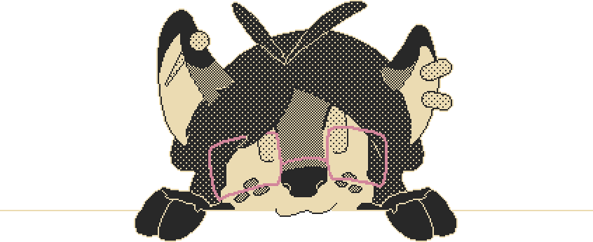

Hi! I'm Lena/Lens (She/They || It/Deer). I make stuff and think about stuff.
Artist, Linguist, Translator, Hobbyist frontend dev.
Mediocre polymath and obnoxious piece of shit.
I like deer.

I am proficient in multiple tools and programming languages:

I am also fluent in Spanish, English, Japanese, Portuguese and Toki Pona.
I am currently learning Lojban and slowly working on designing a touch-mediated Tokiponido

You can find me on
[Tumblr](https://lensdeer.tumblr.com) | [My Website](https://lensdeer.neocities.org)

